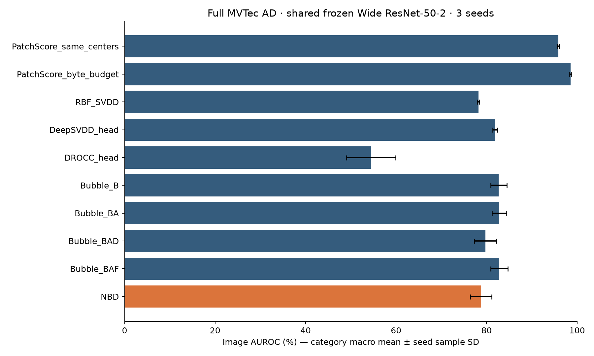

# NBD controlled image benchmark

New implementation from the supplied slides and primary method sources.
The old `nbdbench` source/config/results were not supplied. This is not a recovery
of that source or an exact reproduction of the papers' benchmark tables.

## Completed benchmark

Full MVTec AD: **15 categories × 3 seeds, 450 metric rows**. NBD is the fixed B+A+D+F variant. Values below are category-macro image AUROC, mean ± sample SD across three seeds.

| Variant | Image AUROC (%) |
|---|---:|
| PatchScore_same_centers | 95.86 ± 0.23 |
| PatchScore_byte_budget | 98.56 ± 0.21 |
| RBF_SVDD | 78.20 ± 0.26 |
| DeepSVDD_head | 81.85 ± 0.52 |
| DROCC_head | 54.45 ± 5.43 |
| Bubble_B | 82.70 ± 1.81 |
| Bubble_BA | 82.80 ± 1.62 |
| Bubble_BAD | 79.72 ± 2.46 |
| Bubble_BAF | 82.82 ± 1.88 |
| NBD | 78.79 ± 2.37 |

**NBD underperformed both PatchScore controls:** −17.07 ± 2.22 percentage points versus same centers and −19.77 ± 2.29 versus the geometric byte budget. No ablation or seed replaces the declared NBD result.

**For OpenAI / slide updates, start with [SLIDE_UPDATE_HANDOFF.md](results/mvtec-full-v2/SLIDE_UPDATE_HANDOFF.md).** It contains the full table, page-by-page slide changes, interpretation and verification evidence.

- [Full report](results/mvtec-full-v2/REPORT.md) and [all benchmark evidence](results/mvtec-full-v2/)
- [Per-category/per-seed metrics](results/mvtec-full-v2/per_category_per_seed.csv), [all image predictions](results/mvtec-full-v2/predictions_all.csv), [training histories](results/mvtec-full-v2/training_histories.csv)
- [Full feature/checkpoint replay](results/mvtec-full-v2/reverification.json), [independent CSV audit](results/mvtec-full-v2/independent_csv_audit.json), [backup verification](results/mvtec-full-v2/backup_verified.json), [GPU shutdown evidence](results/mvtec-full-v2/execution_closure.json)

All 45 runs, 135 replay groups and the independent CSV audit passed; the maximum replay score error was 0.0. The training source passed 17 CUDA regression tests. The original dataset and fitted checkpoints are retained in the local delivery outside Git; the repository contains code and complete small benchmark evidence.



## Protocol

Run all five algorithm families on the same full MVTec AD dataset, with a frozen
Wide ResNet-50-2 IMAGENET1K_V1 descriptor cache. Every image is included. Original
normal training images are split by image (60% fit / 20% component calibration /
remaining image-threshold calibration), using seeds 0, 1, 2. Original test images
remain untouched until all models and thresholds for a run are fixed.

The backbone is frozen/eval; layer2 and layer3 are average-pooled locally (3x3),
layer3 is bilinearly aligned to layer2, then concatenated into 1536-D descriptors
on a 28x28 grid. Resize 256 / center crop 224 / ImageNet normalization. There is
no global PCA, random backbone, test tuning, early stopping, or epoch truncation.
Local PCA is part of NBD itself. All fit patches train the deep heads each epoch.
The terminal epoch is the selected checkpoint, regardless of test performance.

NBD uses 128 farthest-first seeds over ALL fit patches, neighborhoods of 128,
local rank 16, local neighborhood means as bubble centers, the bidirectional
energy graph, projector distances, and all nonconstant diffusion eigenmodes.
Component calibration uses all held-out normal patches with the exact >= tail
count and add-one smoothing from slide 16. Parameters in `configs/full.json`
are declared before testing; those absent from the slides are new protocol choices.

Ten variants: same-center PatchScore; byte-budget PatchScore; RBF SVDD;
Deep SVDD head; DROCC head; bubble B; bubble B+A; B+A+D; B+A+F; NBD B+A+D+F.
All use the same top-1% mean image aggregation, including PatchScore controls
(the older slide's max aggregation is not used in this controlled table).
Same-center PatchScore uses the exact fitted NBD centers. Byte-budget PatchScore
uses farthest-first normal patches, with raw float32 model-array bytes no greater
than NBD's geometric/graph arrays. Common backbone and calibration state are
reported separately and excluded from this geometric-budget comparison.

RBF SVDD solves the actual box-constrained dual QP, not an estimator relabeled
as SVDD. A declared 2048-point farthest-first support training set bounds the
quadratic kernel solve; it is selected only from the full fit cache. This is a
memory-constrained SVDD adaptation, not full-kernel optimization over every patch.
Gamma is the reciprocal median positive squared distance on that training set.
Heads train on all fit patches; batch size 8192 is a new shared-feature setting.
DROCC radius is 0.5 times the median normal 5-NN distance: 2048 seeded query
patches searched against ALL fit patches, excluding self. The estimator and its
query IDs are saved. Projected gradient ascent uses 50 steps and gamma 2.

Image metrics: AUROC, average precision, normal-only calibrated threshold,
test FPR/TPR and confusion counts. Alpha=0.05; if the threshold calibration set
is too small to support that finite conformal order statistic, threshold=+inf
and the resulting zero detection rate is retained. No test-optimized F1 cutoff.
Seeds summarize category macro means with sample standard deviation (ddof=1).
Saved 28x28 score maps are not called evaluated segmentation results.

## Sources

- Supplied `review.pdf`, particularly pages 3-6 and 10-16, and
  `CODEX_HANDOFF.md` (input hashes recorded in `docs/source_provenance.json`;
  the original documents are retained in the local delivery).
- Deep SVDD: https://proceedings.mlr.press/v80/ruff18a.html and
  https://github.com/lukasruff/Deep-SVDD-PyTorch
- DROCC: https://proceedings.mlr.press/v119/goyal20c.html and
  https://github.com/microsoft/EdgeML
- PatchCore reference (our PatchScore is not full PatchCore):
  https://github.com/amazon-science/patchcore-inspection
- MVTec AD: https://www.mvtec.com/research-teaching/datasets/mvtec-ad

The older WDBC/Wine/Digits table is historical and is not re-used as a new result.

## Commands

Use the same CUDA Python executable for every command:

```
python -m pytest -q
python -m nbdbench.run --config configs/full.json --data data/mvtec_ad --output outputs/full-v2
python -m nbdbench.report --output outputs/full-v2
python -m nbdbench.verify --output outputs/full-v2 --data data/mvtec_ad --replay
```

See the generated report, manifest, per-run logs/checkpoints/predictions and
verification files for completed results. A running or failed job is not a score.

On a fresh Linux CUDA machine with `uv`, run `scripts/bootstrap_linux.sh`, then
`scripts/run_full.sh`. PyTorch/torchvision are pinned to the CUDA 12.8 wheel pair;
scientific dependencies are pinned in `requirements-science.txt`. Installed
packages are recorded in [training-environment.txt](docs/training-environment.txt),
with the normalized package-origin entry documented in the adjacent provenance
JSON. The raw `pip-freeze.txt` is retained in the local output archive.
Set `NBD_PYTHON` to reuse an already verified CUDA environment.
See [the rerun guide](docs/REPRODUCING.md) for offline dataset/backbone reuse,
checkpoint replay and a fresh training run in a separate output directory.

Completed runs are reused only after their artifact checksums pass. Incomplete
neural stages resume from model, optimizer and CPU/CUDA RNG state at an epoch
boundary. Changing any Python module, numerical config, dataset manifest or
backbone requires a fresh output directory. Do not overwrite an older run to
hide a protocol change. The full replay command regenerates the descriptor cache
and checks its SHA-256 before rescoring every calibration/threshold/test patch.

`docs/source_provenance.json` records the primary sources and input-document
identities; `docs/VALIDATION.md` records preflight checks. Large datasets and
checkpoints are intentionally excluded from Git. Keep the full `outputs/` copy
and the backbone checkpoint as the local artifact backup; small final tables,
reports and plot assets can be published under `results/`.
