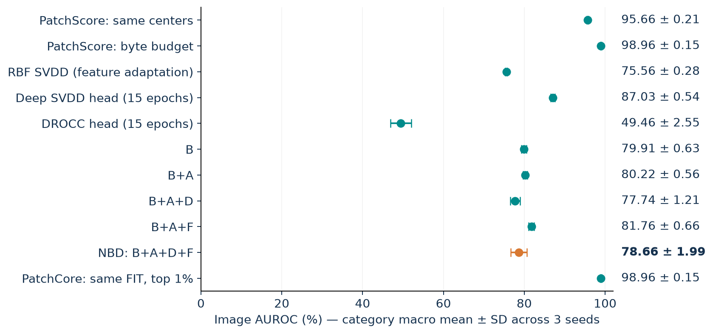

# OCC: NBD and source-audited anomaly detection benchmarks

Latest delivery: 14 September 2026. One shared MVTec comparison, plus separate
native-dataset evaluations for each method.

**NBD B+A+D+F: 78.66 ± 1.99% image AUROC; 90.99 ± 0.77% AP.**
All 15 MVTec categories × 3 seeds × 11 variants, using author WR50-2/V1 1,024-D
features and the same held-out image splits. Mean ± sample SD across seed macro means.

- [Updated slide PDF](slides/paper-faithful-review/review.pdf) · [Overleaf source](slides/paper-faithful-review/review.tex)
- **[Handoff for OpenAI / slide updates](results/reproduction-2026-09-14/SLIDE_UPDATE_HANDOFF.md)**
- [Full report](results/reproduction-2026-09-14/REPRODUCTION_REPORT.md) · [Common table](results/reproduction-2026-09-14/common_summary.csv)
- [Native tables](results/reproduction-2026-09-14/native_summary.csv) · [Exact coverage](results/reproduction-2026-09-14/coverage.csv)
- [Independent metric audit](results/reproduction-2026-09-14/independent_metric_audit.json) · [Rerun guide](docs/reproduction/RERUN.md)
- [Source audit](docs/reproduction/SOURCE_AUDIT.md) · [Pinned sources](source_lock.json)

The user selected about two hours remaining and reduced epochs: native Deep SVDD
AE 5 + SVDD 12, native DROCC 5, common deep heads 15. PatchCore/NBD/kernel fitting keeps
its declared non-epoch protocol. These are measured reduced-epoch method
replications, **not full-schedule historical-paper reproductions**. Native image
CNNs and shared-feature heads are labeled separately. Best-test-selected DROCC
is retained as an explicitly optimistic source behavior. Tax 2004's exact numeric
experiment remains unreproduced because historical settings were not recovered.

All selected matrix rows completed.

Git contains code, raw predictions, histories, configs, evidence and slide source/PDF.
Large fitted checkpoints, maps, original datasets and V1 weights are excluded
from Git history. The verified backup spans this local checkout and ten incremental
checkpoint ZIPs in the [GitHub Release](https://github.com/dathuynh1108/OCC/releases/tag/reproduction-2026-09-14),
which also contains the final Overleaf ZIP. See [backup and restore](docs/reproduction/BACKUP_RESTORE.md)
for exact coverage and checksum verification. Runtime/lifecycle status is recorded
in [execution_closure.json](results/reproduction-2026-09-14/execution_closure.json).

To reproduce: follow [RERUN.md](docs/reproduction/RERUN.md).
`run_plan_budgeted.json` is the measured short schedule; `run_plan.json` retains
original long schedules with separate output identities. Source licenses remain
with each pinned upstream checkout. Dataset images are not redistributed in Git.

Historical v2 results remain unchanged: [v2 report](results/mvtec-full-v2/REPORT.md),
[v2 README](README_V2.md). Their 1536-D feature pipeline and longer head schedules
must not be mixed into this corrected 1024-D experiment.
